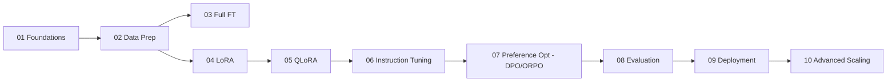

# 🎯 Fine-Tuning Mastery (2026 Edition)

A hands-on, code-first curriculum for fine-tuning Large Language Models — **from basics to advanced**.
Every module is a self-contained, runnable example using the modern 2026 open-source stack
(Hugging Face `transformers` + `peft` + `trl` + `bitsandbytes` + `accelerate`).

> 💡 You can run the small examples on a single consumer GPU (≥ 8 GB VRAM with QLoRA) or
> on CPU/Colab for the toy datasets. Each script has a `--model` flag so you can scale up.

---

## 📚 Curriculum

| # | Module | What you learn | Key libs |
|---|--------|----------------|----------|
| 01 | [Foundations](modules/01_foundations/) | Tokenization, model loading, a from-scratch training loop, what "fine-tuning" actually changes | `torch`, `transformers` |
| 02 | [Data Preparation](modules/02_data_preparation/) | Cleaning, formatting, chat templates, packing, train/val splits | `datasets` |
| 03 | [Full Fine-Tuning](modules/03_full_finetuning/) | Update *all* weights with the `Trainer` API; when it's worth it | `transformers` |
| 04 | [LoRA / PEFT](modules/04_lora_peft/) | Parameter-efficient fine-tuning, adapters, merging | `peft` |
| 05 | [QLoRA & Quantization](modules/05_qlora_quantization/) | 4-bit NF4 training on a single GPU | `bitsandbytes`, `peft` |
| 06 | [Instruction & Chat Tuning](modules/06_instruction_tuning/) | SFT on instruction/chat data with `SFTTrainer` | `trl` |
| 07 | [Preference Optimization](modules/07_preference_optimization/) | Align with human preferences via DPO & ORPO (the RLHF successors) | `trl` |
| 08 | [Evaluation](modules/08_evaluation/) | Perplexity, task metrics, LLM-as-judge, regression tests | `evaluate`, `lm-eval` |
| 09 | [Deployment & Serving](modules/09_deployment_serving/) | Merge adapters, export, quantize for inference, serve with vLLM | `vllm`, `transformers` |
| 10 | [Advanced Topics](modules/10_advanced/) | Multi-GPU (FSDP/DeepSpeed), long-context, packing, gradient checkpointing | `accelerate`, `deepspeed` |

---

## 🚀 Quick Start

```bash
# 1. Create an environment (Python 3.10–3.12 recommended)
python -m venv .venv
# Windows
.venv\Scripts\activate
# macOS / Linux
# source .venv/bin/activate

# 2. Install the core stack
pip install -r requirements.txt

# 3. Run the very first example (CPU-friendly, tiny model)
python modules/01_foundations/01_hello_finetuning.py

# 4. Run a real LoRA fine-tune (needs a GPU, downloads a small model)
python modules/04_lora_peft/train_lora.py --model HuggingFaceTB/SmolLM2-135M-Instruct
```

See [`SETUP.md`](SETUP.md) for GPU drivers, CUDA, Windows notes, and Colab usage.

---

## 🧭 Recommended Learning Path



**If you only have time for the essentials (the 2026 "default" workflow):**
`02 → 05 (QLoRA) → 06 (SFT) → 07 (DPO) → 08 (Eval) → 09 (Serve)`.

---

## 🧩 Repo Layout

```
finetuning-mastery/
├── README.md
├── SETUP.md
├── requirements.txt
├── common/                 # shared helpers (config, data, metrics)
│   ├── config.py
│   ├── data_utils.py
│   └── model_utils.py
├── data/
│   └── sample_instructions.jsonl
└── modules/
    ├── 01_foundations/
    ├── 02_data_preparation/
    ├── 03_full_finetuning/
    ├── 04_lora_peft/
    ├── 05_qlora_quantization/
    ├── 06_instruction_tuning/
    ├── 07_preference_optimization/
    ├── 08_evaluation/
    ├── 09_deployment_serving/
    └── 10_advanced/
```

---

## ⚖️ Choosing a Method (2026 cheat sheet)

| Situation | Use |
|-----------|-----|
| Single GPU, ≤ 24 GB VRAM, want max quality/cost ratio | **QLoRA** (Module 05) |
| Need to ship many task variants from one base model | **LoRA adapters** (Module 04) |
| You have lots of compute and need to change model "behavior" deeply | **Full fine-tuning** (Module 03) |
| Teaching a model to follow instructions / chat | **SFT** (Module 06) |
| Aligning to preferences without a reward model | **DPO / ORPO** (Module 07) |
| Multi-node / 70B+ models | **FSDP or DeepSpeed ZeRO-3** (Module 10) |

---

## 📖 License & Attribution

MIT-licensed examples. Models and datasets retain their own licenses — check each before commercial use.
